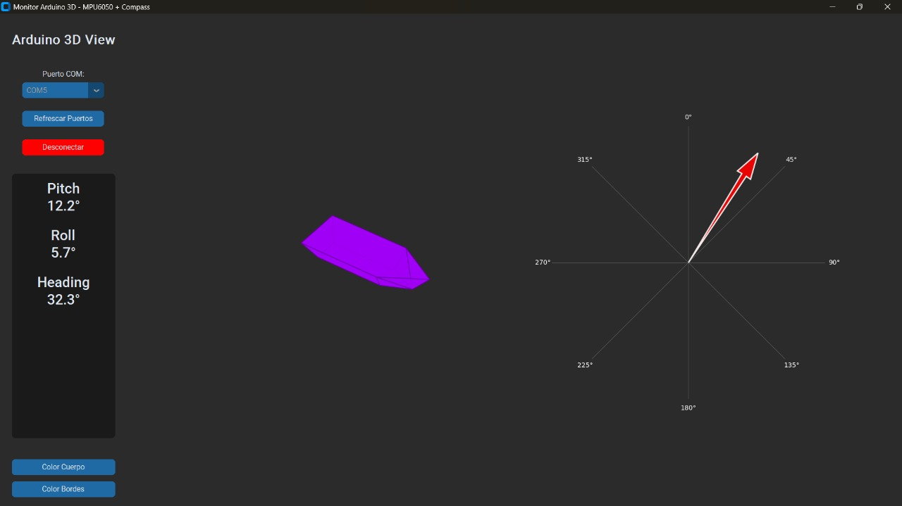

# Barco Monitor - Arduino 3D Visualization

Este proyecto es una aplicación de escritorio en Python para monitorear en tiempo real la orientación (Pitch, Roll) y el rumbo (Heading) de un barco (o cualquier objeto) utilizando sensores conectados a un Arduino.



## Características

- **Visualización 3D en Tiempo Real**: Muestra un modelo 3D de un barco que rota sincronizado con los datos del sensor.
- **Brújula Digital**: Visualización tipo "Rosa de los Vientos" para mostrar el rumbo magnético.
- **Interfaz Moderna**: Construida con `customtkinter` para un modo oscuro elegante y controles intuitivos.
- **Conexión Serial**: Detección automática y conexión a puertos COM para leer datos del Arduino.
- **Personalización**: Permite cambiar los colores del modelo 3D en tiempo real.

## Hardware Requerido

- **Arduino** (Uno, Nano, Mega, etc.)
- **Sensor MPU6050** (Acelerómetro + Giroscopio) para Pitch y Roll.
- **Sensor HMC5883L** (Magnetómetro) para el Rumbo (Compass).
- Cables de conexión.


## Requisitos de Software

- Python 3.8 o superior.
- Librerías listadas en `requirements.txt`.

## Instalación y Uso

1.  **Configurar Arduino**:
    - Carga el sketch `IntegratedSensor.ino` en tu placa Arduino.
    - Asegúrate de tener las librerías necesarias instaladas en el Arduino IDE (Adafruit MPU6050, Adafruit Unified Sensor, Adafruit HMC5883L).

2.  **Configurar Python**:
    - Clona este repositorio o descarga los archivos.
    - Instala las dependencias:
      ```bash
      pip install -r requirements.txt
      ```

3.  **Ejecutar**:
    - Conecta el Arduino al puerto USB.
    - Ejecuta la aplicación:
      ```bash
      python main.py
      ```
    - En la interfaz, selecciona el puerto COM correcto y haz clic en "Conectar".

## Estructura del Proyecto

- `main.py`: Código principal de la aplicación Python.
- `IntegratedSensor.ino`: Código para el microcontrolador Arduino.
- `requirements.txt`: Lista de dependencias de Python.

## Capturas de Pantalla


---
Desarrollado para monitoreo de navegación y telemetría.
